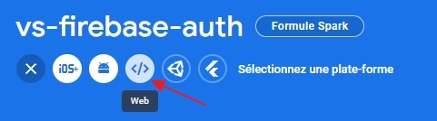
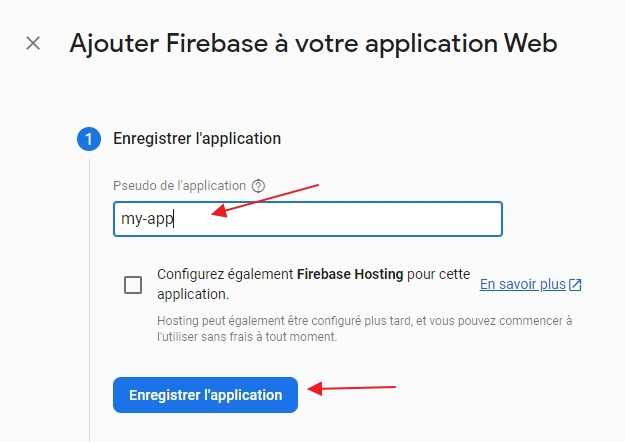
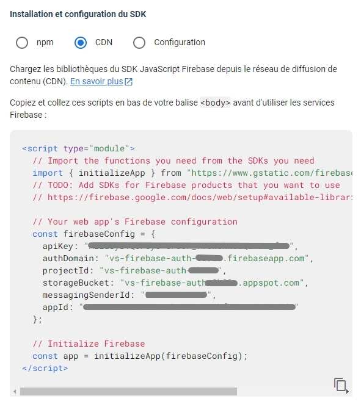

# Vue.js + Firebase Authentication

## Differences between course and current Firebase

**_The following is true on October 20th 2023._**

Once you create you project, you need to register an application:

- select the `Web` technology

- give a name to your app and confirm the registration

- go to the settings to retrieve the configuration code

