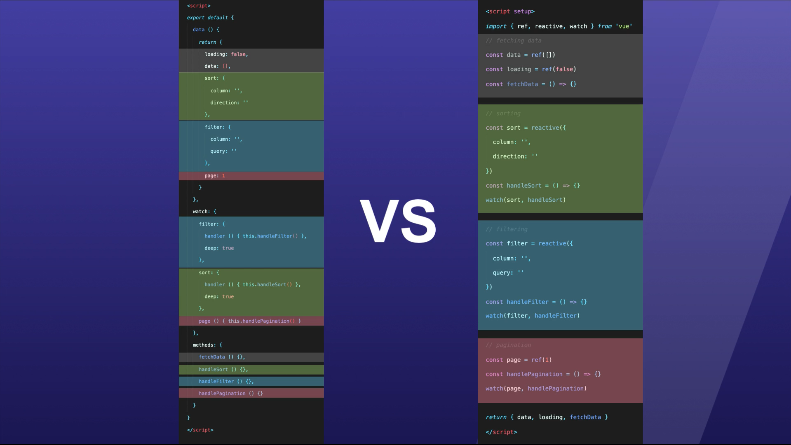

# Vue.js 3 Fundamentals with the Composition API

## Composition API doesn't replace the Options API

You can use both once.

It was named _Functions API_ because it defines a lot of methods to _compose_ with Vue and build your application.

It is available on Vue 2.7 without plugin, otherwise you need a plugin.

## What does the Composition API solves from Options API

### Problem 1: segmented logical concerns

We must break up the logical concerns to fit things in the differents options.

With Composition API, you can group the logical concerns.

See below for an example:



### Problem 2: Flawed reusable component logic with mixins

On the Options API, mixins:

- obscure source of component data, meaning you might have no idea a data property comes from a mixin,

  - except if you tell yourself that if it is not in the component, then it is probably in a mixin.
  - if the property is in a global mixin, it could be real hard to find.

- don't allow efficient intellisense in the IDE
- lead to naming collisions, even if you can softly enforce rules, nothing will check them automatically.

With Composition API and using composables,

- it is easier to share and reuse logic across components of the application
- it is very clear where the data property come from. See at [6:35 in lesson "Introduction to the Vue.js 3 Composition API"](https://vueschool.io/lessons/introduction-to-the-vue-js-3-composition-api).

### Problem 3: No or limited support of Typescript in Options API

In Vue 2 and the Options API, using Typescript was limited.

With the Composition API, it is available out of the box.

## Using declared variables in the script tag

For data types, you need to use `.value` to access the underlying value as Vue 3 uses proxies in order to create reactive data.

## Differences between `ref` and `reactive` functions

With `reactive`, you don't need to use the `.value` property to access the value of the reactive variable.

### When to use `ref` or `reactive`

Either:

- use `ref` all the time.
- use `reactive` on array and objects **ONLY**.

**DO NOT USE `reactive` on primitives!**. For that, either:

- use `ref`
- wrap the primitive into an object and use `reactive`.

### `reactive` is not easily replaced

That means you cannot overwrite the reactive variable with a non reactive variable.

### Automatic unwrapping in template

Vue does the autowrapping in the template, so you need to use `.value` in the script tag.

Plus, with [the proper setup of Visual Studio Code for Vue.js](course-setup-visual-studio-code-for-vuejs.md), you'll get a autocomplete when using a reactive variable.

## Questions

### What is the best practices about organizing the code in the script tag?

You should group all computed, data, methods, etc that deal with one feature of the component together.

There is no standard for ordering within the various groups of logical concern.Simply find something that works for your team.

Also, it'd be a good idea to put `defineProps` and `defineEmits` at the top of the component as they are describing the components interface and not it's internal logic. Plus they must all be defined together and can't be broken up into the logical concern groupings.

### When to use the Composition API versus Options API

I find that the Options API more structured and the Composition API more flexible.

After completing the courses at VueSchool.io, I think I perfer the Composition API.

### Event definition

It is recommended in Vue 3 to define the component's events for better documentation about how a component should work.

It also gives hints to the IDE to make TypeScript work better.

You perform this in the script setup, using the `defineEmits` that takes an array of strings.

Using TypeScript, it looks like this:

```tsx
const emits = defineEmits<{
  (event: "@add-post", request: PostAddRequest): void;
  (event: "@update-post", request: PostUpdateRequest): void;
}>();
```

You need to define an interface for the payload, above I named it `request` and each event listener uses a clear interface.

The good practice is also to prefix the event with a `@` so that there is no conflict possible in the templates:

```htm
<post-editor
  v-if="routeAllowsToPost"
  :thread-id="id"
  :source-post="null"
  @@add-post="savePost"
/>
```

Read [more in the docs](https://vuejs.org/guide/components/events.html).
