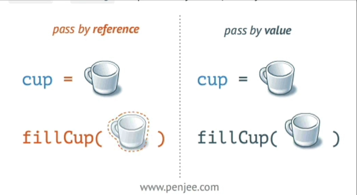

# All about Vue 3 Composition API

## The `setup` method

It is the entry point.

It takes 2 parameters:

- a list of props
- a context object

You define the props above the setup method in the same way we do it in the Options API.

Inside the setup method, we accuess the props using the first parameter:

```javascript
    props: {
      name: String,
      price: Number
    },
    setup(props){
      console.log(props.name);
      console.log(props.price);
    }
```

We can destructure the context to extract `attr`, `slots` and `emits` for example.

```javascript
    setup(props, {attrs, slots, emit}){
      /* your code here */
    }
```

We can use whatever we want from the context. For example, we can use `emit` only

## Reactivity is not explicit, you have to tell Vue

### For primitives

Primitives are string, integers, boolean.

A variable in the setup method is not reactive by default.

Using `ref`, you can tell Vue it is.

```javascript
  import { ref } from "vue";
    export default {
      setup() {
        const name = ref("The Snazzy Burger");
        return { name };
      }
    }

```

Without using `ref`, you could not edit `name` in Vue DevTools.

`ref` is a reactive reference.



Using a `ref` variable, you will need to use `.value` to read or modify it within a `setup` method.

In the template or lifecycle hooks like `created()` where Vue unwrap the `ref`.

**IMPORTANT**: the reason why you should **ALWAYS** declare variable in `setup` as `const` is to prevent breaking the reactivity by using `let` and assigning a non-ref value to your initially declared `ref` variable.

### For non primitives

Non-primitives are objects and arrays.

You can use `ref`, but you also have `reactive` method.

```javascript
    import { ref, reactive } from "vue";
    export default {
      setup() {
        const appName = ref("The Snazzy Burger");
        const meal = reactive({name: "Hamburger", price: 5});
        return { appName, meal };
      }
    }
```

One advantage of `reactive` is that it elimates the need to use `.value`.

See [the docs for more cool stuff about reactivity](https://vuejs.org/api/reactivity-utilities.html).

### How to choose `ref` or `reactive`

See [the lesson "Refs vs Reactive With the Vue 3 Composition API"](https://vueschool.io/lessons/refs-vs-reactive-with-the-vue-3-composition-api) for the advantages and disavantages of each.

## Using `computed`

It is very similar to the Options API

```javascript
    import { computed } from "vue";
  export default {
    props: {
      price: Number
    },
    setup(props,){
      const prettyPrice = computed(() => `$${props.price.toFixed(2)}`);

      return {
        prettyPrice,
      }
    }
```

But when using composables, it will provide a new advantage.

## Watching a reactive array

**ALWAYS** copy the reactive array, otherwise, you will work on a reference, not a true copy.

```javascript
//newCart amd oldCart point to the same reference
watch(cart, (newCart, oldCart) => console.log(newCart, oldCart));
```

```javascript
watch(
    //create a copy of the reactive array
    () => [...cart],
    //newCart amd oldCart point to different references
    (newCart, oldCart) => console.log(newCart, oldCart)
);
```

This is true for `ref` or `reactive`.

## `watch` vs `watchEffect`

`watchEffect`:

- fires immediatly
- doesn't need to be told what it depends on by passing the data as first attribut
- doesn't have an old value

For example, with `watch`, we write:

```javascript
  import { watch } from "vue";
    export default {
      setup() {
        const hideCartOnAddItem = watch(() => [...cart], (newCart, oldCart) => alert(newCart.join('\n')));
      }
    }
```

For example, with `watchEffect`, we write:

```javascript
  import { watchEffect } from "vue";
    export default {
      setup() {
        const hideCartOnAddItem = watchEffect(() => alert(cart.join('\n')));
      }
    }
```

So when to use either one? In the example, above `watch`.

Otherwise, ask yourself:

- Do I need access to the old value?
- Will it be a problem if the callback fires inmediatly?

## What about passing variables from component N to component N+2 without using a prop on component N+1

Use the methods `provide` and `inject`.

`provide` defines in the component N the name and value of the variable.

`inject` reads from component N+2 the variable's value defined in `provide` by component N.

A provided variable can be made reactive.

PS: I'd create an utility file to list the names of those types of variables to avoid mistyping the variable name in the `inject` method.

Note: you cannot inject a variable not provided by a parent. However, `inject` takes a second argument to prevent broken code.

```javascript
const currencySymbol = inject('currencySymbol', ref("$"));
```

## Using lifecycle hooks in Composition API

It is as simple as extracting the hook on the import, on as-you-need basis.

See the docs for [the list of methods](https://vuejs.org/api/composition-api-lifecycle.html) supported.

`beforeCreate` and `created` are exception because `setup` is called around those two.

## What is the purpose of `setup` on the script tag

It is implicity return all variables and methods to become useable in the template.

To declare props, use the macro `defineProps` method.

### One caviat about the `setup` attribut

**Only single file component can use it.**

## Avoid mutation of props that are objects

To do so, use the spread operator:

```javascript
const props = defineProps({
  post: Object,
});
const post = { ...props.post };
```

## Use composables

A composable is a file, external to the components, that you can use in any component.

The convention is to:

- put the composables in a dedicated folder `composables` in the `src` directory.
- name the composable with the prefix `use` which is a convention in VueJs community to let people know it is a composable.

For example:

```javascript
import { ref } from 'vue';

export default function usePost() {
  const posts = ref([]);

  const fetchAll = async () => {
    const response = await fetch('https://jsonplaceholder.typicode.com/posts');
    posts.value = await response.json();
  };

  return {
    posts,
    fetchAll,
  };
}
```

## Asynchronous Data and the Composition API

The following breaks the organisation of the code. The logical concerns within the component are mixed up.

### Using `then()`

```javascript
//fetchUser is dependant on the fetchPost, so we wait it resolves.
fetchPost(route.params.id).then(() => {
    fetchUser(post.value.userId);
  });

```

### Using `async` self-invokin anonymous function

```javascript
  (async () => {
    await fetchPost(route.params.id);
    fetchUser(post.value.userId);
  })();//the final () is the call of the function.
```

### Use a `watch`

To keep the logical concerns together, you can use a `watch`:

```javascript
  const { item: post, fetchOne: fetchPost } = useResource('posts');

  const route = useRoute();
  fetchPost(route.params.id);

  const { item: user, fetchOne: fetchUser } = useResource('users');

  watch(
    //when the post changes...
    () => ({...post.value}),
    //call the user api
    () => {
    fetchUser(post.value.userId)
  })
```

### Use of `suspense`

**IMPORTANT**: on January 9th 2024, it is still under an experimental status. See [the docs](https://vuejs.org/guide/built-ins/suspense.html#suspense).

The usage is the following:

```htm
<!--
    the async is just "sugar" syntax, not the same as the asnc keyword on a asynchronous function...
-->
<script setup async>
  import { watch } from "vue";
  import { useRoute } from "vue-router";
  import useResource from '../composables/useResource';

  const { item: post, fetchOne: fetchPost } = useResource('posts');

  const route = useRoute();
  //...mark the function to wait on...
  await fetchPost(route.params.id);

  const { item: user, fetchOne: fetchUser } = useResource('users');
  //...and fetchUser is same to call now since fetchPost is awaited.
  fetchUser(post.value.userId)
</script>
```

To work, you will need to use thte `suspense` component higher up in the components tree, e.g. `App.vue`:

```htm
<!-- in the template of App.vue -->

<suspense>
    <template #default>
        <router-view></router-view>
    </template>
    <template #fallback>
        <p>Loading...</p>
    </template>
</suspense>
```

But with `router-view`, it is more like this:

```htm
<!-- in the template of App.vue -->

<router-view v-slot="{ Component }">
    <template v-if="Component">
        <suspense>
            <template #default>
                <component :is="Component"></component>
            </template>
            <template #fallback>
                <p>Loading...</p>
            </template>
        </suspense>
    </template>
</router-view>
```
